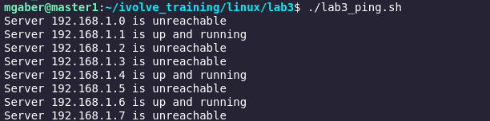

# Ping Subnet Script

## Overview
This shell script is designed to ping every server in the `192.168.1.x` subnet, where `x` ranges from 0 to 255. For each server:
- If the ping succeeds, it displays: `Server 192.168.1.x is up and running`.
- If the ping fails, it displays: `Server 192.168.1.x is unreachable`.

## Features
- Automates the process of pinging a range of IP addresses.
- Provides clear and concise output for each server's status.
- Lightweight and easy to use.

---

## Prerequisites
- **Operating System**: Linux/Unix-based OS.
- **Shell**: The script is written in Bash.
- **Tools**: The `ping` command must be available.

---
## Output of the bash file

