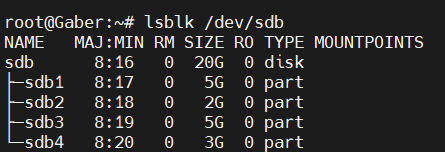

# Disk Management and Logical Volume Setup

This guide provides step-by-step instructions for attaching and managing a 20GB disk in a Linux virtual machine, partitioning it, and configuring its sections as specified.

## Objective

- Attach a 20GB disk to the VM.
- Partition it into the following sections:
  - *5GB* for a file system.
  - *5GB* for a Volume Group (VG) with a Logical Volume (LV).
  - *3GB* to extend the Logical Volume.
  - *2GB* as swap space.

---

## Steps

### *1. Attach a 20GB Disk to the VM*

- Access the virtualization platform (e.g., VirtualBox, VMware, or cloud service).
- Add a new *20GB* disk to the virtual machine.

### **2. Create Two new Partition
Open the fdisk utility:
sudo fdisk /dev/sdb

### **3. Specify Type for second Partition to be Swap
Open the fdisk utility:
sudo fdisk /dev/sdb

### **4. Create and Specify Type for last two partition to be lvm
Open the fdisk utility:
sudo fdisk /dev/sdb

### **5. Checking of Creating Partitions

### **6. Make file system & type of ext4 for standard partiton

### **7. Mount Partion

### **8. Configure Fstab file

### **9. mkswap swap partition

### **10. Make Swap Presistent in fstab

### **11. make system read configraton from fstab

### **12. Create Physical-Volume & Create Volume-Group & Create Logical-Volume

### **13. Extended Logical Volume

### **14. Check all what have Done!

