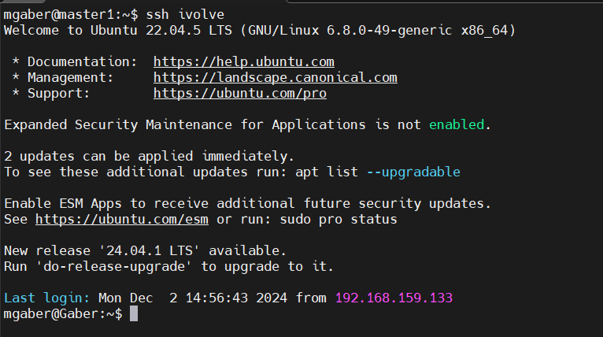

# Lab 6: SSH Configurations

## Objective
The goal of this lab is to:
1. Generate SSH public and private keys.
2. Configure passwordless SSH access from your machine to another VM.
3. Simplify the SSH command by setting up a configuration file to enable login using `ssh ivolve`.

---

## Steps to Achieve the Objective

### 1. Generate SSH Keys
Run the following command to create public and private keys:

### 2. Configure passwordless SSH access from your machine to another VM.

### 3.Simplify the SSH command by setting up a configuration file to enable login using `ssh ivolve`.

